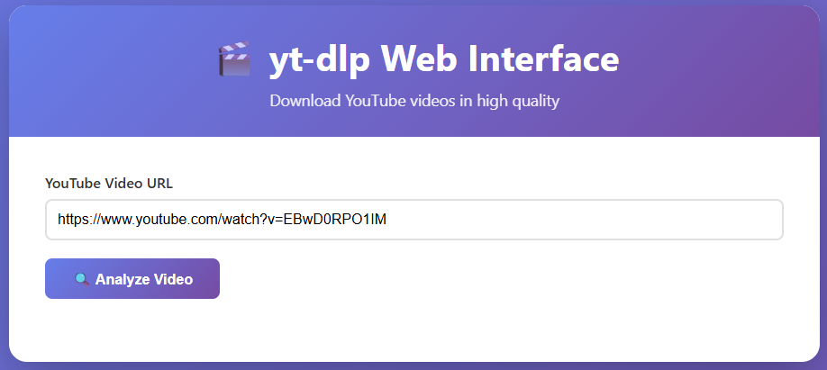
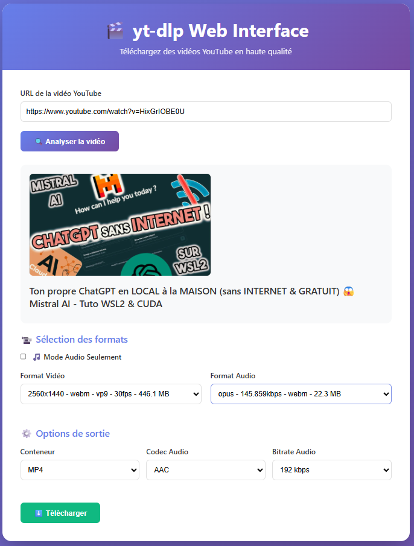
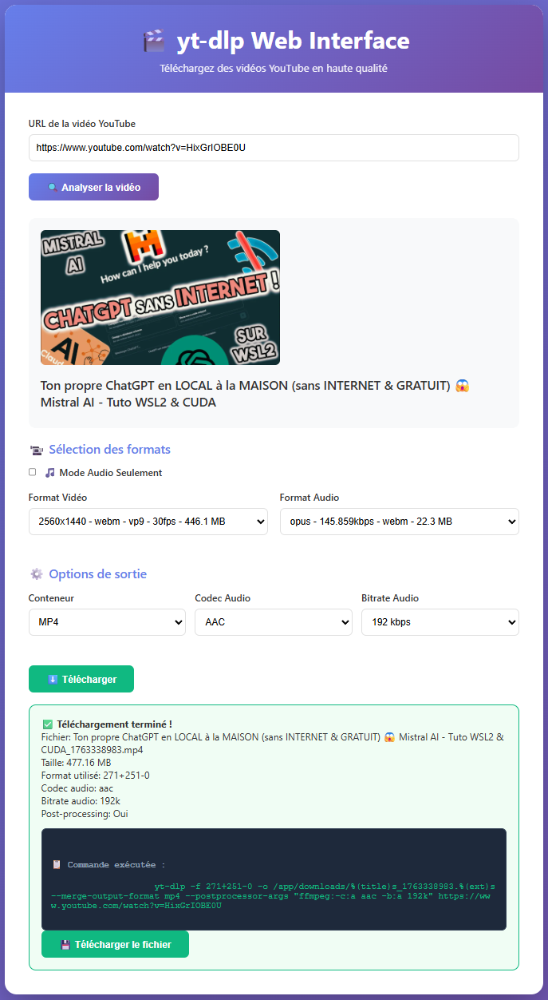

# 🎬 yt-dlp Web Interface

Interface web moderne et sécurisée pour télécharger des vidéos YouTube, avec options de conversion et affichage détaillé. Utilise l'excellent [yt-dlp](https://github.com/yt-dlp/yt-dlp). Le tout conteneurisé avec Docker/Podman. Codé avec mon ami : Claude AI


## ✨ Fonctionnalités

### 🎥 Téléchargement
- 🔍 **Analyse complète** des formats vidéo et audio disponibles
- 🎯 **Sélection précise** des formats (qualité, codec, bitrate)
- ⚙️ **Options de sortie** personnalisables (MP4, MKV, WebM)
- 🎵 **Transcodage audio** (AAC, MP3, Opus) avec contrôle du bitrate
- 🎵 **Mode audio seulement** pour extraire uniquement l'audio

### 📊 Interface & UX
- 📦 **Interface moderne** et responsive
- 📈 **Barre de progression en temps réel** avec SSE (Server-Sent Events)
- ⚡ **Téléchargements non-bloquants** - multiples téléchargements simultanés
- 💨 **Vitesse et ETA** affichés pendant le téléchargement
- 📋 **Affichage de la commande** yt-dlp exécutée pour transparence

### 🔒 Sécurité
- ✅ **Validation stricte des URLs** YouTube (protection contre injection de commandes)
- 🛡️ **Protection path traversal** sécurisée
- 👤 **Container non-root** (exécution en tant qu'utilisateur `appuser`)
- 🔐 **Validation des inputs** (conteneurs, codecs, bitrate)
- 🔍 **Logging complet** pour audit et debugging

### 🚀 Performance & Fiabilité
- 🆔 **Sessions UUID isolées** - pas de conflit entre téléchargements
- 🧹 **Nettoyage automatique** des fichiers anciens (>1h)
- 🔄 **Healthcheck intégré** pour monitoring
- 📝 **Logs détaillés** avec rotation automatique
- 🐳 **Conteneurisé** pour un déploiement facile

## 🚀 Démarrage rapide

### Avec Docker
```bash
docker pull raynoxis/yt-dlp-web-interface:latest
docker run -d -p 5000:5000 --name ytdlp-web raynoxis/yt-dlp-web-interface:latest
```

### Avec Podman
```bash
podman pull docker.io/raynoxis/yt-dlp-web-interface:latest
podman run -d -p 5000:5000 --name ytdlp-web raynoxis/yt-dlp-web-interface:latest
```

### Avec Docker Compose (Recommandé)
```bash
git clone https://github.com/Raynoxis/yt-dlp-Web-Interface.git
cd yt-dlp-Web-Interface

# Pour Docker
docker-compose up -d

# Pour Podman (rootless)
./fix-permissions.sh  # Configure les permissions
podman compose up -d
```

**Note pour WSL2 & Podman** : Un script `fix-permissions.sh` est fourni pour configurer automatiquement les permissions du dossier downloads avec Podman rootless.

Accédez à l'interface : **http://localhost:5001** (ou 5000 si vous utilisez la commande docker run directe)

## 📖 Documentation

- [Installation détaillée](docs/INSTALLATION.md)
- [Guide d'utilisation](docs/USAGE.md)

## 🛠️ Build depuis les sources
```bash
# Cloner le repo
git clone https://github.com/Raynoxis/yt-dlp-Web-Interface.git
cd yt-dlp-Web-Interface

# Build avec Docker
docker build -t raynoxis/yt-dlp-web-interface .

# Ou avec Podman
podman build -t raynoxis/yt-dlp-web-interface .

# Lancer
docker run -d -p 5000:5000 --name ytdlp-web raynoxis/yt-dlp-web-interface
```

## 🎯 Utilisation

1. Collez l'URL d'une vidéo YouTube
2. Cliquez sur **"Analyser la vidéo"**
3. Sélectionnez les formats vidéo et audio souhaités
4. Choisissez les options de sortie (conteneur, codec audio, bitrate)
5. Cliquez sur **"Télécharger"**
6. **Suivez la progression en temps réel** avec la barre de progression
7. Téléchargez le fichier généré

## 📸 Screenshots
### Etape 1 - Analyse


### Etape 2 - Sélection des formats


### Etape 3 - Téléchargement avec progression


## 🔧 Configuration avancée

### Volumes persistants
```bash
docker run -d \
  -p 5000:5000 \
  -v ./downloads:/app/downloads \
  --name ytdlp-web \
  raynoxis/yt-dlp-web-interface:latest
```

### Variables d'environnement
```bash
docker run -d \
  -p 5000:5000 \
  -e FLASK_ENV=production \
  -e PYTHONUNBUFFERED=1 \
  --name ytdlp-web \
  raynoxis/yt-dlp-web-interface:latest
```

### Compose complet
```yaml
version: '3.8'

services:
  ytdlp-webinterface:
    image: raynoxis/yt-dlp-web-interface:latest
    container_name: ytdlp-webinterface
    user: "${UID:-1000}:${GID:-1000}"  # Exécute avec votre UID/GID
    ports:
      - "5001:5000"
    volumes:
      - ./downloads:/app/downloads
    restart: unless-stopped
    environment:
      - FLASK_ENV=production
      - PYTHONUNBUFFERED=1
    healthcheck:
      test: ["CMD", "curl", "-f", "http://localhost:5000/"]
      interval: 30s
      timeout: 10s
      retries: 3
      start_period: 40s
```

**Créer un fichier `.env`** pour définir UID/GID :
```bash
echo "UID=$(id -u)" > .env
echo "GID=$(id -g)" >> .env
```

## 🔐 Sécurité

### Mesures de sécurité implémentées

- ✅ **Validation stricte** : Seules les URLs YouTube valides sont acceptées
- ✅ **Protection injection** : Validation des inputs avant exécution
- ✅ **Path traversal** : Protection contre l'accès à des fichiers non autorisés
- ✅ **Isolation** : Chaque téléchargement dans un répertoire UUID unique
- ✅ **Non-root** : Le container s'exécute avec un utilisateur non-privilégié
- ✅ **Logging** : Tous les événements sont tracés pour audit
- ✅ **Nettoyage** : Suppression automatique des fichiers après 1 heure

### Bonnes pratiques recommandées

```bash
# Utiliser un reverse proxy avec SSL/TLS
# Limiter l'accès par IP avec un firewall
# Configurer des limites de ressources sur le container
docker run -d \
  --memory="2g" \
  --cpus="1.0" \
  -p 5000:5000 \
  raynoxis/yt-dlp-web-interface:latest
```

## 📊 API Endpoints

### Analyse de vidéo
```bash
POST /api/analyze
Content-Type: application/json

{
  "url": "https://www.youtube.com/watch?v=VIDEO_ID"
}
```

### Téléchargement
```bash
POST /api/download
Content-Type: application/json

{
  "url": "https://www.youtube.com/watch?v=VIDEO_ID",
  "video_format": "299",
  "audio_format": "140",
  "output_container": "mp4",
  "audio_codec": "aac",
  "audio_bitrate": "192k",
  "audio_only": false
}
```

### Progression en temps réel (SSE)
```bash
GET /api/progress/<session_id>
```

### Télécharger le fichier
```bash
GET /api/download-file/<session_id>/<filename>
```

### Nettoyage
```bash
POST /api/cleanup/<session_id>
POST /api/cleanup-all
```

## 🗂️ Architecture

```
yt-dlp-Web-Interface/
├── app.py                     # Backend Flask avec SSE
├── templates/
│   └── index.html            # Frontend avec progress bar
├── downloads/                # Fichiers téléchargés (UUID sessions)
│   ├── <uuid-session-1>/
│   └── <uuid-session-2>/
├── Dockerfile                # Image Docker (non-root)
├── docker-compose.yml        # Configuration Compose
└── docs/                     # Documentation
```

## 🔄 Gestion des fichiers

### Nettoyage automatique
- **Déclenchement** : À chaque nouveau téléchargement
- **Rétention** : 1 heure par défaut
- **Action** : Suppression des répertoires de session > 1h

### Nettoyage manuel
```bash
# Nettoyer une session spécifique
curl -X POST http://localhost:5000/api/cleanup/<session_id>

# Nettoyer toutes les sessions
curl -X POST http://localhost:5000/api/cleanup-all
```

## 🐛 Dépannage

### Les téléchargements échouent
- Vérifiez que l'URL YouTube est valide
- Certains formats peuvent ne pas être disponibles
- Consultez les logs : `docker logs ytdlp-web`

### Erreur de permissions (WSL2 / Linux)

**Symptôme** : Erreur serveur 500 lors du téléchargement, ou le conteneur ne démarre pas.

**Cause** : Le répertoire `downloads` appartient à un autre utilisateur (souvent créé par un conteneur root).

**Solutions** :

#### ✅ Solution 1 : Utiliser le fichier .env (Recommandé)
Le fichier `.env` est déjà fourni dans le dépôt. Il configure le conteneur pour s'exécuter avec votre UID/GID :

```bash
# Le fichier .env contient :
UID=1000
GID=1000

# Démarrez simplement avec docker-compose
docker-compose up -d
```

#### ✅ Solution 2 : Recréer le répertoire downloads
Si le répertoire a de mauvaises permissions :

```bash
# Renommer l'ancien répertoire
mv downloads downloads.old

# Créer un nouveau répertoire avec les bonnes permissions
mkdir downloads

# Relancer le conteneur
docker-compose up -d
```

#### ✅ Solution 3 : Corriger les permissions (si vous avez sudo)
```bash
# Donner la propriété à votre utilisateur
sudo chown -R $(id -u):$(id -g) downloads/

# Relancer le conteneur
docker-compose up -d
```

#### ❌ À ÉVITER : user: root
N'ajoutez **JAMAIS** `user: root` dans docker-compose.yml :
- ❌ Risque de sécurité majeur
- ❌ Fichiers téléchargés appartiennent à root
- ❌ Vous ne pouvez pas les supprimer sans sudo

### Erreur de permissions avec Podman (rootless)
Podman en mode rootless utilise un mapping d'UID. Pour que le conteneur puisse écrire dans le dossier downloads :

```bash
# Utiliser le script fourni (recommandé)
./fix-permissions.sh

# OU manuellement :
podman unshare chown 1000:1000 downloads/
podman unshare chmod 755 downloads/

# Puis démarrer le conteneur
podman compose up -d
```

**Explication** : Podman mappe l'UID 1000 du conteneur (appuser) vers l'UID 100999 sur l'hôte. Le script configure automatiquement cette permission.

### Le healthcheck échoue
- Attendez 40 secondes (start_period)
- Vérifiez que le port 5000 est accessible

## 🤝 Contribution

Les contributions sont les bienvenues ! N'hésitez pas à :

1. Fork le projet
2. Créer une branche (`git checkout -b feature/amelioration`)
3. Commit vos changements (`git commit -am 'Ajout nouvelle fonctionnalité'`)
4. Push vers la branche (`git push origin feature/amelioration`)
5. Ouvrir une Pull Request

## 📝 License

Ce projet est sous licence MIT. Voir le fichier [LICENSE](LICENSE) pour plus de détails.

## 🙏 Remerciements

- [yt-dlp](https://github.com/yt-dlp/yt-dlp) - Le meilleur outil de téléchargement vidéo
- [Flask](https://flask.palletsprojects.com/) - Framework web Python
- [FFmpeg](https://ffmpeg.org/) - Traitement vidéo et audio
- [Claude AI](https://claude.ai) - Assistant de développement

## 📈 Changelog

### v2.0.2 (2025-11-28)
- 🐛 Fix permissions issues with Podman rootless mode
- 📝 Add `fix-permissions.sh` script for easy setup
- 🔧 Update Dockerfile to not pre-create downloads folder
- 📚 Improve documentation for Podman users

### v2.0.1 (2025-11-27)
- 📝 Update documentation with WSL2 permissions fix

### v2.0.0 (2025-11-25)
- ✨ Ajout de la barre de progression en temps réel avec SSE
- 🔒 Amélioration majeure de la sécurité (validation URL, path traversal)
- 🆔 Sessions UUID isolées pour téléchargements concurrents
- 👤 Container non-root pour meilleure sécurité
- 📝 Logging complet pour audit et debugging
- ⚡ Téléchargements non-bloquants avec threads
- 🧹 Nettoyage automatique des sessions anciennes

### v1.0.0 (Initial)
- 🎬 Interface web pour yt-dlp
- 🎯 Sélection de formats vidéo/audio
- 🎵 Mode audio seulement
- 🐳 Conteneurisation Docker/Podman

## ⚠️ Avertissement

Cet outil est destiné à un usage personnel et éducatif. Respectez les conditions d'utilisation de YouTube et les lois sur le droit d'auteur de votre pays.

## 📧 Contact

Raynoxis - [GitHub](https://github.com/Raynoxis)

Lien du projet: [https://github.com/Raynoxis/yt-dlp-Web-Interface](https://github.com/Raynoxis/yt-dlp-Web-Interface)

Lien Docker Hub: [https://hub.docker.com/r/raynoxis/yt-dlp-web-interface](https://hub.docker.com/r/raynoxis/yt-dlp-web-interface)
